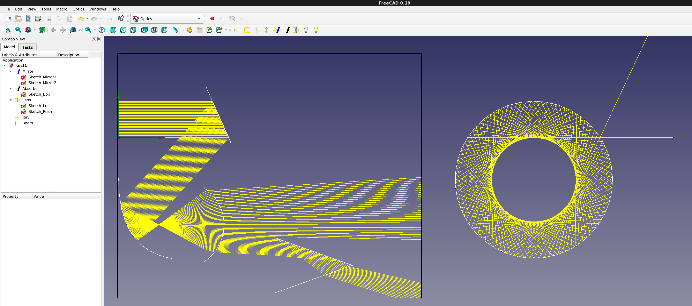
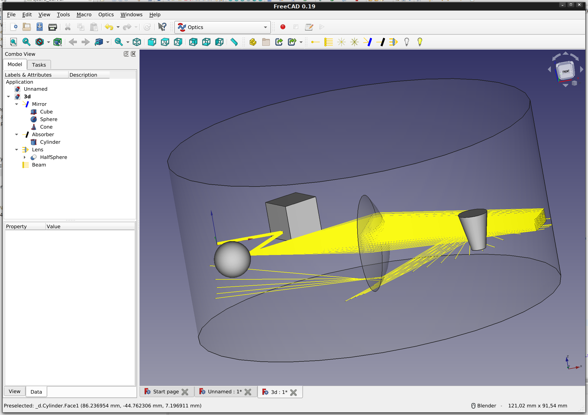

#  Optics Workbench
    
Geometrical optics for FreeCAD.  
Performs simple raytracing through your FreeCAD objects.

[](https://lgtm.com/projects/g/chbergmann/OpticsWorkbench/alerts/)
[](https://lgtm.com/projects/g/chbergmann/OpticsWorkbench/context:python)


  
## Installation


### Manual Installation

```bash
cd ~/.FreeCAD/Mod/ 
git clone https://github.com/chbergmann/OpticsWorkbench.git
```
When you restart FreeCAD, "Optics Workbench" workbench should now show up in the [workbench dropdown list](https://freecadweb.org/wiki/Std_Workbench).
  
## Getting started
- Create some FreeCAD design objects. For 2D simulation Sketches will do the job.
- Select one or more of your design objects and then create Optical Mirror to let your objects act as mirrors
- Select one or more of your design objects and then create Optical Absorber to let your objects act as black walls for the light rays
- Select one or more of your design objects and then create Optical Lenses to let your objects act as lenses. Lenses should be closed shapes. 
Select a material in the Lens properties or provide a refraction index.
- Add some source of light (Ray, Beam). 

## Tools
###  Ray
A single ray for raytracing  
Parameters:
- Power: On or Off  
- Spherical: False=Beam in one direction, True=Radial or spherical rays
- BeamNrColumns: Number of rays in a beam per row
- BeamNrRows: Number of rays in a beam per column
- BeamDistance: Distance between two beams
- HideFirstPart: Hide the first part of every ray that comes from the source and goes to the first point of reflection/refraction/nirvana
- MaxRayLength: Maximum length of a ray
- MaxNrReflections: Maximum number of reflections. This prevents endless loops if the ray is inside a mirror box.

###  2D Beam
A row of multiple rays for raytracing  
Parameters: see Ray. BeamNrColumns must be > 1 to get a beam

###  2D Radial Beam
Rays coming from one point going to all directions in a 2D plane  
Parameters: see Ray. BeamNrColumns must be > 1 and BeamNrRows=1 and Spherical=True to get a radial beam

###  Spherical Beam
Rays coming from one point going to all directions  
Parameters: see Ray. BeamNrColumns and BeamNrRows must be > 1 Spherical=True to get a spherical beam

###  Optical Mirror
The FreeCAD objects in parameter Base will act as mirrors  
Select some FreeCAD objects, then create Optical Mirror

###  Optical Absorber
The FreeCAD objects in parameter Base will swallow the rays of light  
Select some FreeCAD objects, then create Optical Absorber

###  Optical Lens
The FreeCAD objects in parameter Base will act as lenses  
Select some FreeCAD objects, then create Optical Lens  
The Refration Index has to be provided. The parameter Material contains a list with pre defined refraction indexes.

###  Switch off lights
Switches off all Rays and Beams

###  (Re)start simulation
Switches on and recalculates all Rays and Beams

###  Example 2D
generates the screenshot above

###  Example 3D


## Issues and Troubleshooting
see [issues on Github](https://github.com/chbergmann/OpticsWorkbench/issues)

## Discussion
Please offer feedback or connect with the developer via the [dedicated FreeCAD forum thread](https://forum.freecadweb.org/viewtopic.php?f=8&t=59860).

## License
GNU Lesser General Public License v3.0 ([LICENSE](LICENSE))
